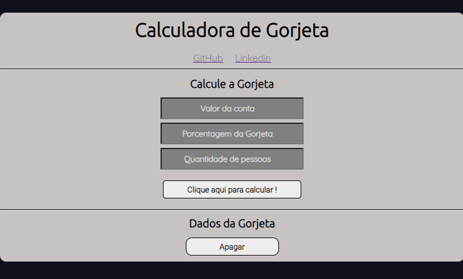
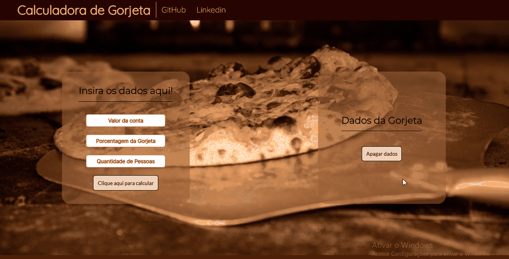

<h1 align = "center">Calculadora de Gorjetas</h1>

## Badges

<h4 align = "Center"> 
    :construction:  Projeto em construção  :construction:
</h4>

## Descrição do Projeto

Calculadora de Gorjeta desenvolvida em JavaScript

## Índice

* [Badges](#badges)
* [Descrição do Projeto](#descrição-do-projeto)
* [Índice](#índice)
* [Funcionalidades e Demonstração da Aplicação](#funcionalidades-e-demonstração-da-aplicação)
* [Tecnologias utilizadas](#tecnologias-utilizadas)
* [Licença](#licença)

## Funcionalidades e Demonstração da Aplicação

O projeto possui 2 partes principais, a área onde esta os inputs e onde sera mostrada as informações do calculo

Sendo 3 inputs, sendo eles: Valor de conta, Porcentagem e Quantidades de pessoas

  
<h3 align = "center">

</h3>

Dependendo da quantidade de pessoas colocadas, sendo o minimo uma, ele oculta alguns valores pois causaria uma poluição de conteudo que não seria nescessario no momento

<h3 align = "center">

</h3>

Na area dos inputs os erros são 3, um erro para cada área de input.

<h3 align = "center">

</h3>

Já o outro seria sobre não existir dados a serem apagados pela pagina

## Tecnologias utilizadas

- ``Html``
- ``CSS``
- ``JavaScript``

## Licença

Calculadora de Gorjetas e licenciado por [MIT license](./docs).
