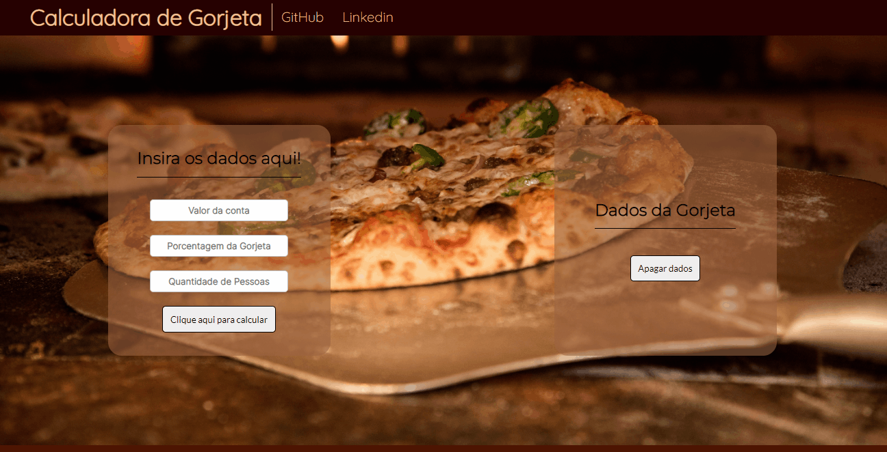

<h1 align = "center">Calculadora de Gorjetas</h1>

## Badges

<h4 align = "Center"> 
    :construction:  Projeto em construção  :construction:
</h4>

## Descrição do Projeto

Calculadora de Gorjeta desenvolvida em JavaScript 

## Índice

* [Badges](#badges)
* [Descrição do Projeto](#descrição-do-projeto)
* [Status do Projeto](#status-do-projeto)
* [Índice](#índice)
* [Funcionalidades e Demonstração da Aplicação](#funcionalidades-e-demonstração-da-aplicação)
* [Acesso ao Projeto](#acesso-ao-projeto)
* [Tecnologias utilizadas](#tecnologias-utilizadas)
* [Pessoas Contribuidoras](#pessoas-contribuidoras)
* [Pessoas Desenvolvedoras do Projeto](#pessoas-desenvolvedoras)
* [Licença](#licença)
* [Conclusão](#conclusão)

## Funcionalidades e Demonstração da Aplicação

O projeto em seu estado atual conta apenas com a calculadora 

<h1 align = "center">

</h1>
